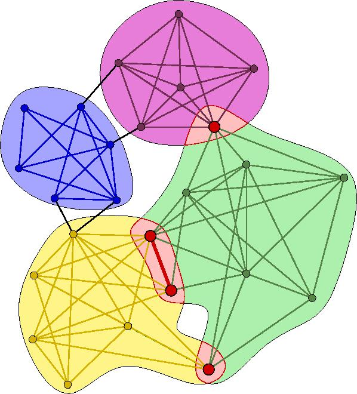
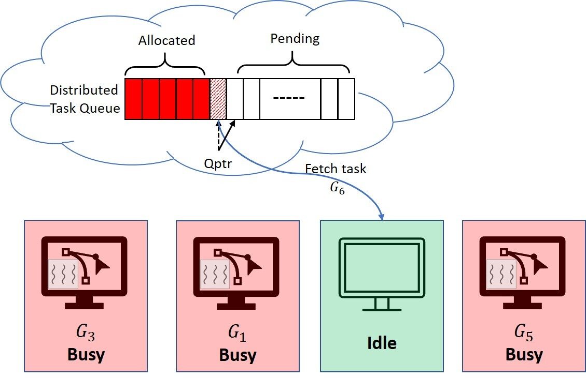

# Distributed Memory K-Clique Enumeration

||
|:--:|
|**Cliques of varying sizes in a graph**|

Members: Christopher Fucci, Kartik Lakhotia, Niki Tavakoli

## Introduction
A *k*-clique is a fully connected dense subgraph with **k** vertices. 
Clique enumeration is widely used for data mining on graph structures. 
However, clique enumeration exhibits high computational complexity which increases exponentially with **k**.<br /><br />

This is an implementation of parallel algorithm for k-clique enumeration that can scale clique enumeration/counting on large-scale clusters.
While existing algorithms only utilized shared-memory parallelism, our implementation exploits both shared- and distributed-memory parallelism. 

1. **Multiple nodes** in a cluster utilize parallelism over subgraphs in the partitioned graph.
2. **Multiple threads** in a node utilize parallelism over vertices in the subgraph.

## Vertex Ordering
To avoid repeated counting and reduce complexity, vertices in *k*-cliques are always discovered in a monotonic order of their ranking. We use a **degeneracy** based ranking.
This restricts the maximum size of vertex neighborhood in ordered DAG (Ref: [kClist](https://github.com/maxdan94/kClist)). <br />
Within the induced subgraph of each vertex' neighbors, we use graph coloring to reduce search space, especially for large *k* (Ref: [DDegCol](https://github.com/gawssin/kcliquelisting/tree/master/ddegcol)). 


## Approach
#### Storage
Our aim is to reduce the runtime of clique enumeration. 
To this purpose, a copy of graph is stored on every node.
Off the shelf compute nodes are easily able to store graphs with multi-billion edges (topology only).
Thus, we avoid expensive network communication during clique counting/enumeration.<br /><br />

#### Task Partitioning 
Given a graph *G(V, E)*, we divide the vertex set *V* into *p* partitions - {*V<sub>1</sub>, V<sub>2</sub> ... V<sub>p</sub>*}.
Counting cliques starting from vertices in *V<sub>i</sub>* represents the *i<sup>th</sup>* task.<br />

Vertices are assigned to partitions in a cyclic manner.

#### Methodology
1. Each machine loads the graph and computes degeneracy based ranking.
2. A task queue is initialized on `MPI Rank 0` and an RMA window is created to expose the task queue to all machines in `MPI_COMM_WORLD`.
3. When a node is idle, it pops a task from the queue and updates the queue pointer. 
This is done using `MPI_Fetch_and_op` operation to avoid synchronization between nodes and ensure uniqueness of tasks processed by each node. 
If task queue is empty, jump to step 7. 
4. After fetching the *i<sup>th</sup>* task, the node builds an induced subgraph *G<sub>i</sub>* on *V<sub>i</sub>* and its neighborhood. 
Edges in the induced subgraph are optionally filtered using their *k*-truss values.
5. Then it proceeds to count the cliques in *G<sub>i</sub>*, with starting vertices in *V<sub>i</sub>* (in parallel using multiple threads).
6. Repeat: jump to step 3.
7. Use `MPI_Reduce` to accumulate the contribution of each compute node and report.  


||
|:--:|
|**Dyanmic task (subgraph) scheduling through distributed task queue and MPI RMA operations**|


#### Optimizations
1. Cyclic (over)partitioning and Dynamic Scheduling  
- Improves load balance.
2. Truss and runtime degree based approaches to filter the search space.  
- Improve computational efficiency (especially for large *k*)
3. Hybrid Shared-memory + Distributed-memory parallelism  
- Reduces memory overhead (compared to pure MPI implementation) and enables fine-grained parallelism across vertices


## Compile
```
make
```

Running this command will compile and return the executables for the shared memory K-clique program and distributed memory K-clique program (cliqueShared and cliqueParallel respectively). We utilize Open MPI's "wrapper" compiler mpic++ and use C++ 11. 

## Run

To run the distributed memory program:
```
mpirun -n <# ranks> --map-by ppr:1:node ./cliqueParallel <num_threads> <k> <graphFile>
```

For example, the command
```
mpirun -n 2 --map-by ppr:1:node ./cliqueParallel 8 5 xyz.txt
```
will launch 2 MPI Ranks on different compute nodes, and use 8 threads per rank to count 5-cliques in the graph specified in xyz.txt file.

To run the shared memory program:
```
./cliqueShared <num_threads> <k> <graphFile>
```

The input file should represent graph in an edge list format where each line is a tuple of two integers as shown below:
```
u v
```
This indicates that there is an edge between vertices `u` and `v`.<br /><br />


## Acknowledgements
We used a base code from the works of:
 
1. Danisch, Maximilien, Oana Balalau, and Mauro Sozio. "Listing k-cliques in sparse real-world graphs." Proceedings of the 2018 World Wide Web Conference. 2018 [Code](https://github.com/maxdan94/kClist).
2. Li, Rong-Hua, et al. "Ordering heuristics for k-clique listing." Proceedings of the VLDB Endowment 13.12 (2020) [Code](https://github.com/gawssin/kcliquelisting/tree/master/ddegcol).


## Future Work
Currently, we target moderately-sized graphs and deep cliques (computationally intensive). Hence, the graph is replicated on all nodes. In the future, we want to partition the graph so that is not replicated on all nodes and use work stealing for load balancing.<br />
We will also use a distributed-memory parallel algorithm to compute degeneracy based ranking, instead of individually computing on each node.
